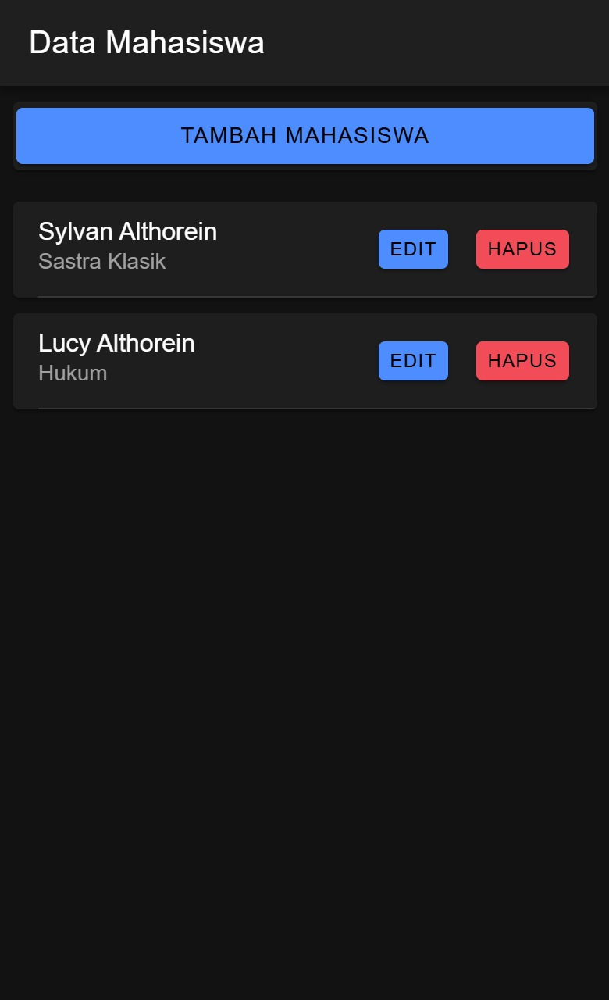
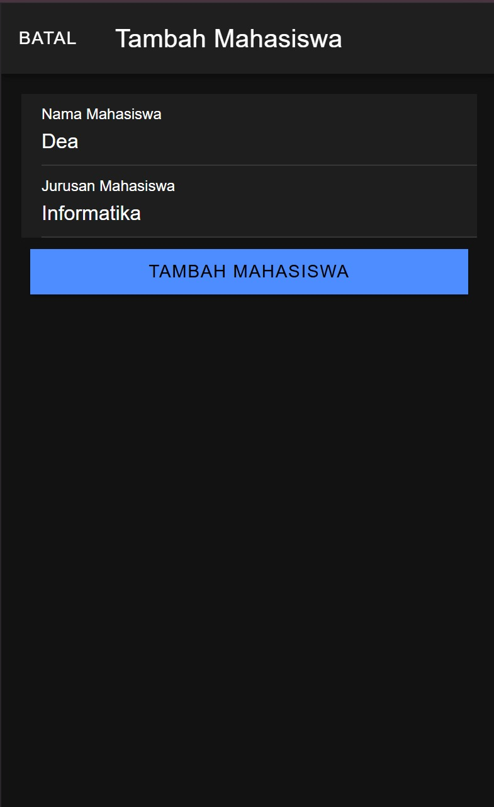
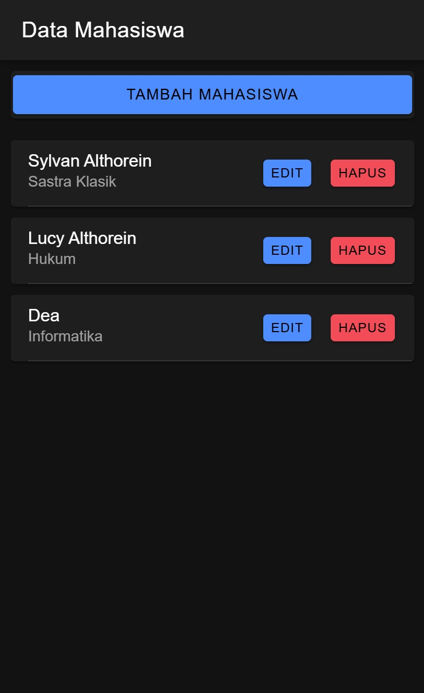
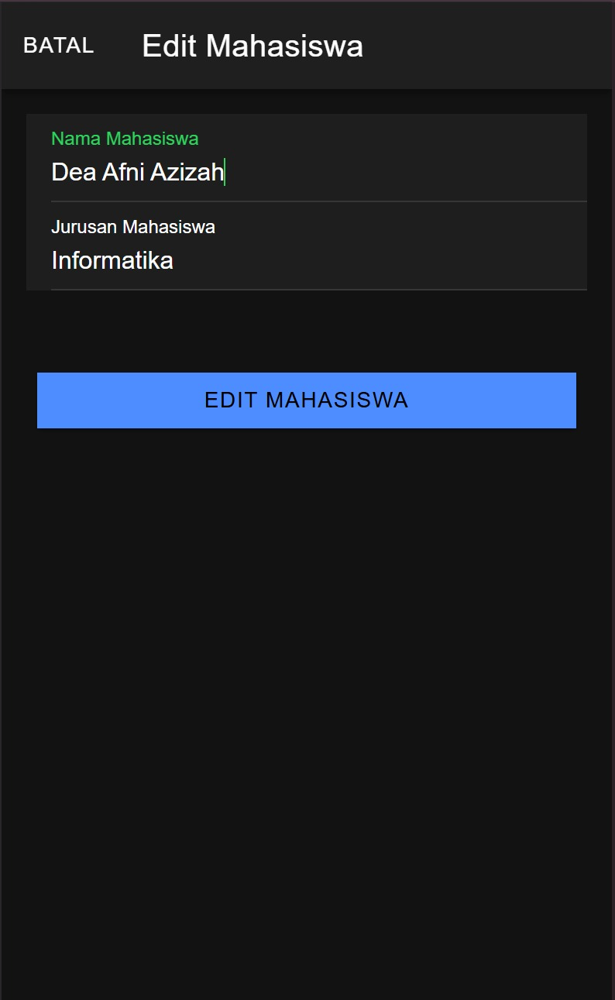
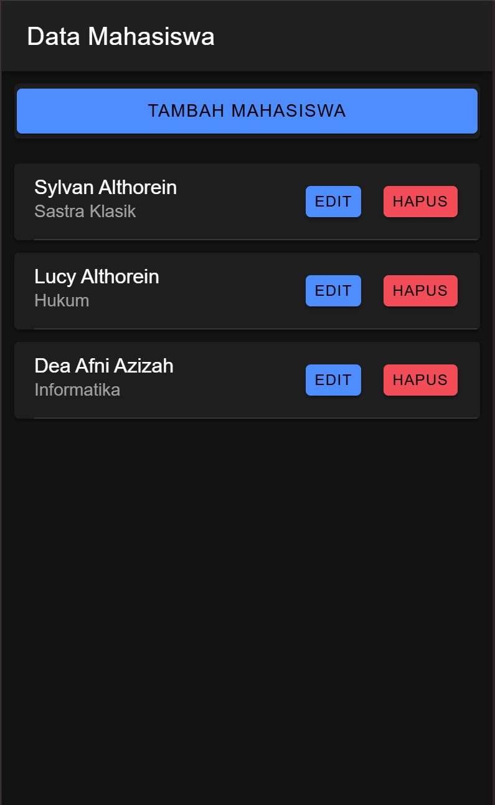
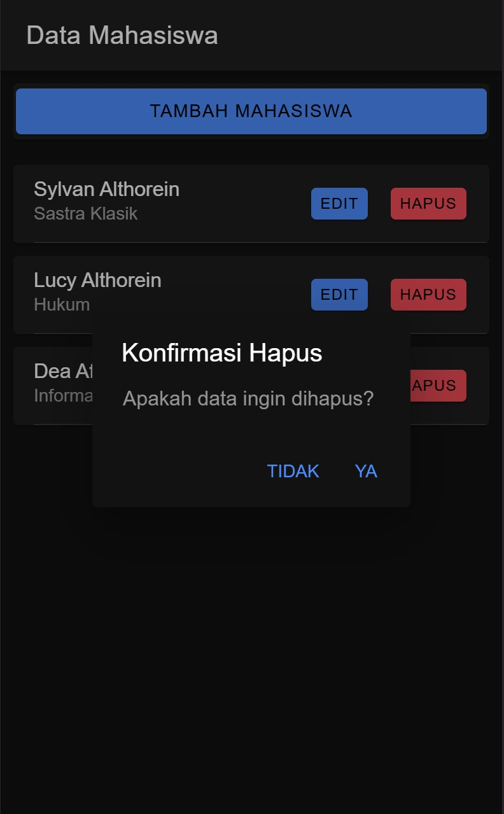

Nama : Dea Afni Azizah

NIM : H1D022093

Shift Baru: C

## Screenshot tampilan:
1. Halaman Awal
   
   Setelah menjalanankan project ionic, tampilan ini yang akan menyambut user. Terdapat header dengan teks "Data Mahasiswa", di bawahnya ada tombol "TAMBAH MAHASISWA" untuk menambah data mahasiswa. Setelah itu terdapat list data mahasiswa yang terdapat di database; terlihat nama, jurusan, juga dua tombol, "EDIT" berwarna biru dan "HAPUS" berwarna merah.
3. Menambah Data
   
   Ketika menekan tombol "TAMBAH MAHASISWA", modal Tambah Data akan ditampilkan. Di ujung kiri atas terdapat tombol "BATAL" untuk membatalkan pengisian form tambah data. Form tambah data sendiri terdapat dua field untuk mengisi Nama dan Jurusan. Untuk menambahkan data yang sudah dimasukkan ke dalam form menuju database, terdapat tombol "TAMBAH MAHASISWA" tepat di bawah form.
   
   Setelah mengirim data, modal Tambah Data langsung ditutup dan kembali ke halaman awal. Namun sekarang, data yang dikirim sekarang sudah muncul di list data mahasiswa.
5. Mengedit Data
   
   Ketika menekan tombol "EDIT" di salah satu mahasiswa, modal Edit Data akan ditampilkan. Tampilannya mirip dengan Tambah Data. Di sini bisa dilakukan pengeditan data, misalnya mengganti nama atau jurusan. Seperti Tambah Data, terdapat tombol "EDIT MAHASISWA" untuk mengirim perubahan ke database.
   
   Setelah mengirim perubahan, Edit Data tertutup dan perubahan pada data langsung terlihat di halaman awal.
7. Menghapus Data
   
   Ketika menekan tombol "HAPUS" di salah satu mahasiswa, muncul pop up konfirmasi "Apakah data ingin dihapus?" sebelum data terhapus. Terdapat dua pilihan antara "TIDAK" dan "YA".
   
   Setelah menekan "YA", data segera terhapus dan tidak lagi terlihat di halaman awal karena data sudah dihapus di database.
